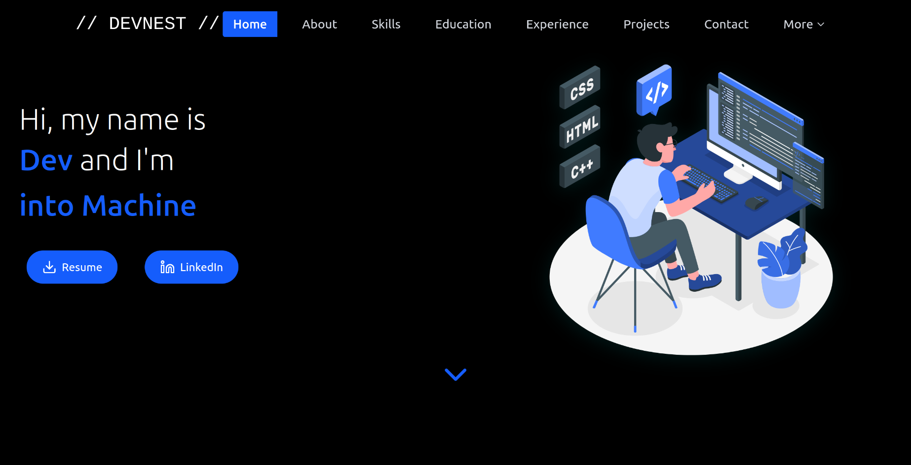

# Personal Website Template



To see more screenshots look into screenshot folder.

This project started as a hobby project in 2022 with the goal of creating a personal website. It was originally built using HTML, CSS, and some JavaScript. Over time, the need for a more scalable and maintainable structure led to rebuilding the site using modern technologies like React, Vite, and Tailwind CSS.

This project has served as a learning experience in modern front-end development, with a focus on reusable components, responsive design, and clean UI/UX.

---

## 🛠️ Technologies Used

- **React** – JavaScript library for building user interfaces.
- **Vite** – Fast and lightweight development build tool.
- **Tailwind CSS** – Utility-first CSS framework.
- **Illustrations** – From [Undraw](https://undraw.co/).
- **Icons & Animations** – Lucid Icons, React Icons, Spline.
- **Color Palette** – Primary color: `#3c77fc`
- **Unsplash** - For website Images
---

## 🌐 Website Structure

The project includes the following pages and features:

- **Home** – Contains multiple sections as separate components: Hero, About, Skills, Education, Experience, Projects, Contact.
- **Blog** – Displays latest 10 blog posts from a Medium profile (replace with your own if desired).
- **Nest** – An inspirational page that can include playlists, quotes, etc.
- **Docs** – A page to write your own tutorials for sample, there is git and github tutorial.
---

## 🚧 Features to Add (To-Do)

- [X] Dark Mode
- [X] Code Optimization
- [X] Image Optimization
- [X] Sticky Navigation
- [X] Active Navigation Highlighting

---

## 📦 Getting Started

Clone the repository and install dependencies:

```bash
git clone https://github.com/eatulrajput/personal_website.git
cd personal_website
npm install
npm run dev
````

Then open [http://localhost:5173](http://localhost:5173) in your browser.

---

## 🔄 Customization

You can customize this template by editing:

* Content in the components (inside `src/components`)
* Styling with Tailwind utility classes
* Blog fetch logic (API call to your own Medium or other platform)

---

## 📄 License

This project is licensed under the [MIT License](./LICENSE).
You are free to use, modify, and distribute it as you wish.

---

## 🙌 Contributions

This repository is no longer maintained by the original creator, but feel free to:

* Fork and customize it
* Use it as inspiration for your own site
* Share it with others

---

## 🧾 Credits

This project was inspired by various portfolio sites and learning resources across the web.
Design, structure, and content were put together with simplicity and reusability in mind.

